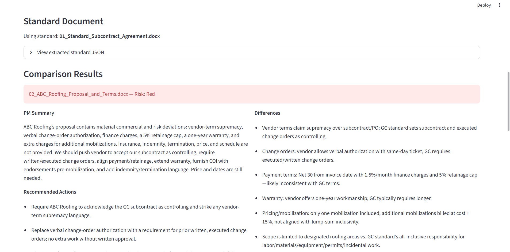
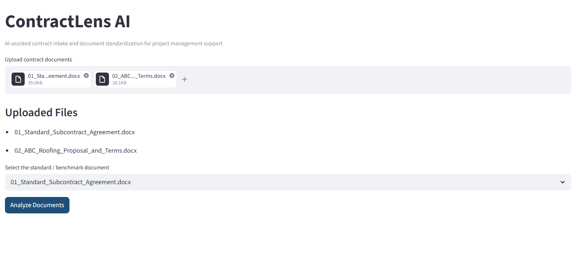
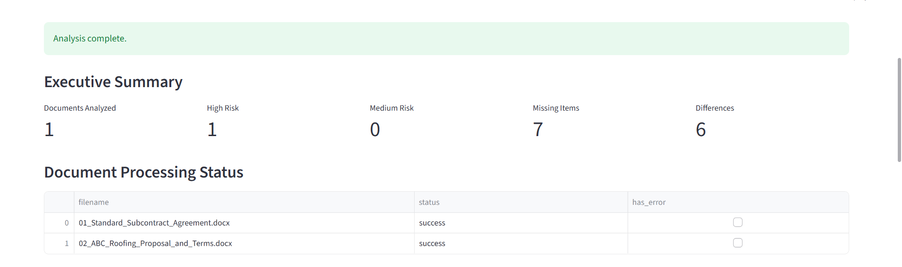
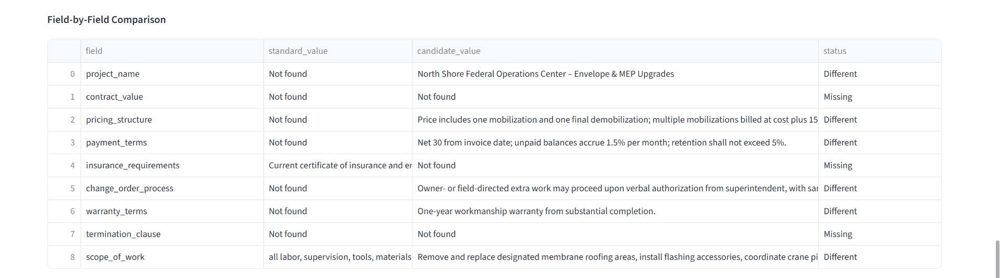
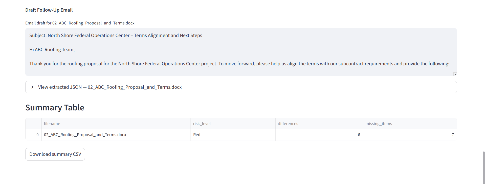

# ContractLens AI

<p align="center">
  <b>AI-assisted contract intake and comparison MVP for general contractor project management support.</b>
</p>

<p align="center">
  
  
  
  
  
</p>

<p align="center">
  <i>A practical AI-assisted prototype that helps general contractor project teams review differently formatted subcontractor and vendor documents, compare them against a benchmark structure, and surface major differences, missing items, and follow-up needs faster.</i>
</p>

<p align="center">
  
</p>

---

## Overview

ContractLens AI is a **Streamlit-based MVP** designed to support **project managers and project support teams in a general contractor environment**.

General contractors often receive documents in inconsistent formats, including:

- subcontractor proposals
- vendor commercial terms
- scope letters
- insurance summaries
- pricing sheets
- supporting contract documents

Reviewing these manually takes time and increases the chance of missing important differences in:

- payment terms
- pricing structure
- warranty language
- insurance requirements
- change-order approval process
- non-standard vendor language

ContractLens AI was built to explore how **AI-assisted extraction + comparison** can reduce manual review burden and improve visibility into contract-related risk areas.

---

## Problem Statement

In a general contractor workflow, project teams often deal with multiple subcontractors and vendors, each using their own document format and commercial language.

That creates three operational problems:

1. **Review is slow**  
   Project teams spend time manually reading and comparing documents.

2. **Important differences are easy to miss**  
   Non-standard terms in pricing, insurance, warranty, or change-order language can be buried in long documents.

3. **Project managers lose time on admin-heavy review work**  
   Instead of focusing on coordination and execution, time gets spent organizing and following up on document inconsistencies.

---

## Solution

**ContractLens AI** is an AI-assisted contract intake and comparison prototype that:

- uploads contract-related documents
- extracts key contractual and commercial fields
- compares vendor/subcontractor documents against a benchmark standard
- flags major differences, missing items, and risk signals
- generates PM-friendly summaries
- generates draft follow-up email language

---

## MVP Scope

This project is intentionally presented as a **working MVP/prototype**, not a production-ready legal review system.

### What it already does well
- surfaces many major contractual and commercial differences
- highlights missing or non-standard items
- shows field-by-field comparison outputs
- generates project-manager-oriented review summaries
- provides draft follow-up language for vendor communication

### What it does **not** claim
- full legal-grade accuracy
- fully production-ready reliability
- replacement for formal legal review

---

## Feature Highlights

<table>
  <tr>
    <td width="50%">
      <h3>AI-Assisted Field Extraction</h3>
      <p>Extracts key fields from differently formatted contract-related documents.</p>
      <ul>
        <li>Project name</li>
        <li>Scope of work</li>
        <li>Contract value</li>
        <li>Pricing structure</li>
        <li>Payment terms</li>
        <li>Insurance requirements</li>
        <li>Warranty terms</li>
        <li>Change-order process</li>
      </ul>
    </td>
    <td width="50%">
      <h3>Standard vs Candidate Comparison</h3>
      <p>Compares vendor/subcontractor documents against a benchmark standard.</p>
      <ul>
        <li>Match</li>
        <li>Different</li>
        <li>Missing</li>
      </ul>
    </td>
  </tr>
  <tr>
    <td width="50%">
      <h3>Executive Summary View</h3>
      <p>Provides quick review visibility across uploaded documents.</p>
      <ul>
        <li>Documents analyzed</li>
        <li>Differences found</li>
        <li>Missing items</li>
        <li>Review support outputs</li>
      </ul>
    </td>
    <td width="50%">
      <h3>PM-Friendly Outputs</h3>
      <p>Generates practical outputs for project support workflows.</p>
      <ul>
        <li>PM summaries</li>
        <li>Recommended actions</li>
        <li>Field-by-field comparison table</li>
        <li>Draft follow-up email</li>
      </ul>
    </td>
  </tr>
</table>

---

## Example Workflow

1. Upload a **standard / benchmark contract document**
2. Upload one or more **vendor or subcontractor documents**
3. Select the benchmark document in the UI
4. Run analysis
5. Review:
   - extracted JSON
   - field-by-field comparison
   - PM summary
   - recommended actions
   - follow-up email draft

---

## Screenshots

### 1. Document Upload & Benchmark Selection
Shows the upload workflow where the user selects a standard / benchmark contract and one or more comparison documents.



### 2. Comparison Results Overview
Shows the overall comparison results, including differences, missing items, and summary outputs for the uploaded documents.


### 3. Executive Summary Dashboard
Shows the top-level summary view with document-level review metrics and quick visibility into key review outcomes.



### 4. Field-by-Field Comparison
Shows the detailed comparison table for benchmark vs. candidate document fields such as pricing, payment terms, insurance, warranty, and scope.



### 5. PM Summary & Follow-Up Drafts
Shows the project-manager-friendly outputs, including recommended actions and draft follow-up email language.



---

## Demo Scenario

This project uses a **synthetic contract pack** for demonstration.

Example test case:
- **Standard document:** O’Neill-style standard subcontract agreement
- **Comparison document:** ABC Roofing proposal and terms

The MVP is designed to surface issues such as:
- payment term differences
- warranty mismatches
- lower or incomplete insurance alignment
- non-standard change-order approval language
- pricing structure differences
- vendor language that conflicts with standard expectations

---

## Tech Stack

### Core
- **Python**
- **Streamlit**
- **OpenAI API**

### Document Processing
- **PyMuPDF**
- **python-docx**

### Data & Output
- **Pandas**
- **ReportLab**

---

## Project Structure

```text
contractlens-ai/
│
├── app.py
├── requirements.txt
├── .env
├── .gitignore
│
├── data/
│   └── synthetic_docs/
│
├── src/
│   ├── __init__.py
│   ├── config.py
│   ├── parsers.py
│   ├── prompts.py
│   ├── llm_client.py
│   ├── comparator.py
│   ├── utils.py
│   └── rule_extractor.py
│
└── .streamlit/
    └── config.toml


---

## How to Run the Project
### 1. Clone the repository

git clone https://github.com/YOUR_USERNAME/contractlens-ai.git
cd contractlens-ai

### 2. Create and activate a virtual environment
Windows PowerShell

python3 -m venv .venv
source .venv/bin/activate

macOS / Linux

python3 -m venv .venv
source .venv/bin/activate

### 3. Install dependencies

pip install -r requirements.txt

### 4. Add your OpenAI API key

## Create a .env file in the project root:

OPENAI_API_KEY=your_openai_api_key_here
OPENAI_MODEL=gpt-5

### 5. Run the Streamlit app

python -m streamlit run app.py


## Recommended Demo Setup

### To demo the app:

upload the synthetic standard subcontract agreement
upload one or more synthetic vendor/subcontractor documents
select the standard document as the benchmark
click Analyze Documents
Synthetic Test Pack

This project uses synthetic documents for demo purposes. These files are intended to simulate realistic review scenarios such as:

different pricing terms
warranty mismatches
insurance gaps
non-standard change-order language
vendor terms that conflict with standard expectations

## Positioning Statement

ContractLens AI is an AI-assisted contract intake and comparison prototype designed for general contractor project support. It helps project teams review differently formatted subcontractor and vendor documents, extract key terms, compare them against a standard structure, and flag major differences or missing items so project managers can move faster with less manual review.

## Future Improvements
Stronger extraction from contract tables and labeled sections
Better insurance-limit and pricing extraction
Clause-level comparison
Confidence scores for extracted fields
Exportable PM review reports
Larger evaluation dataset
Improved handling of varied document layouts
Disclaimer

This project is a prototype for workflow support and portfolio demonstration. It is not legal advice and is not intended to replace formal contract or legal review.

Author

Joel Nithish Kumar
